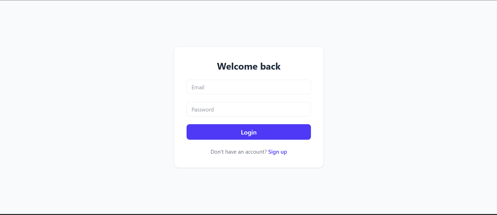
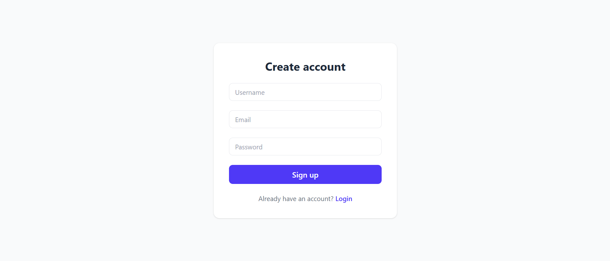
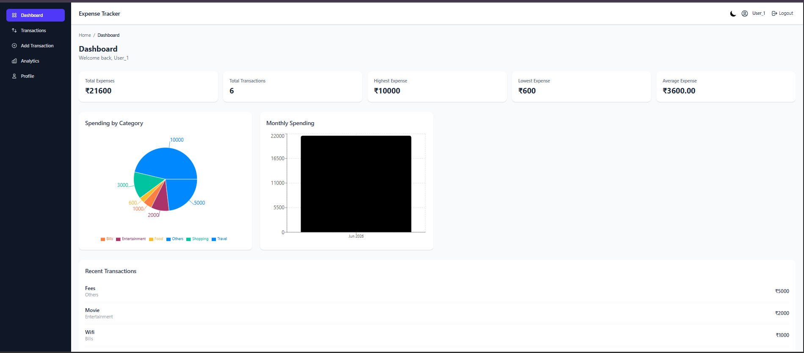
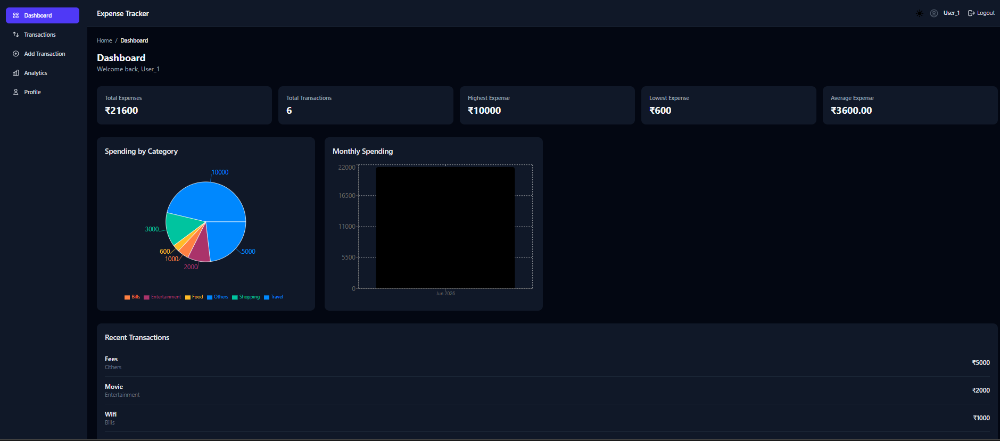
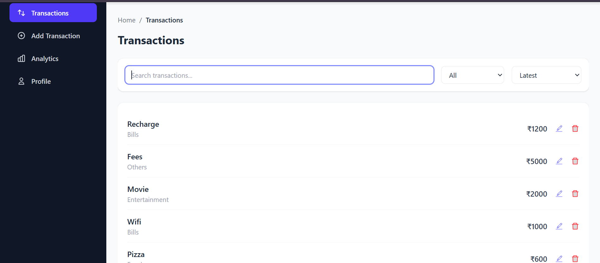
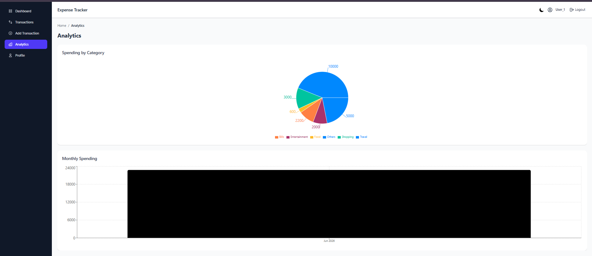
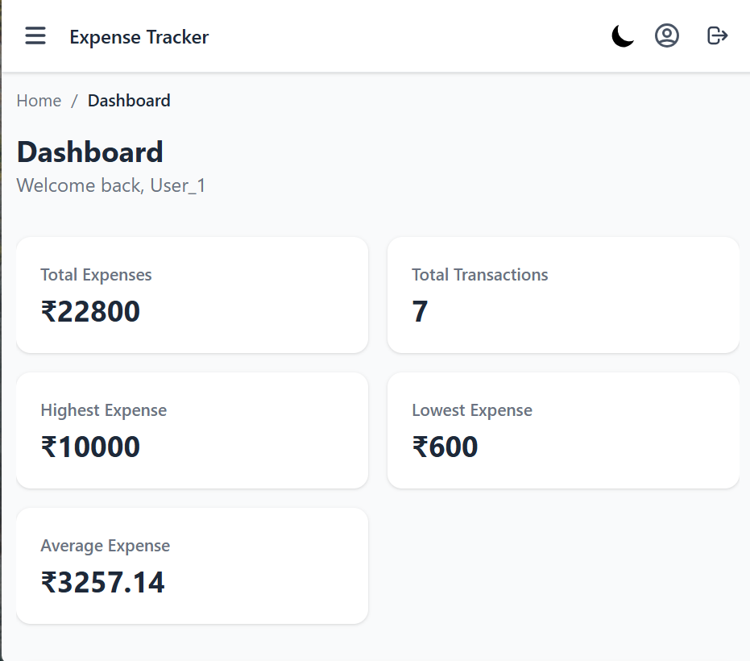

# Expense Tracker

A full-stack MERN expense tracking application with JWT authentication, real-time analytics, and a responsive multi-page dashboard.

**Live Demo:** 

Frontend: https://expense-tracker-rm1emlkzc-mern-stack5.vercel.app

Backend API: https://expense-tracker-api-vsil.onrender.com

---

## Overview

Expense Tracker helps users log, categorize, and analyze their daily spending. It includes secure user authentication, full CRUD operations on expenses, search/filter/sort capabilities, and visual analytics via charts — all wrapped in a responsive, mobile-friendly UI.

---

## Features

- **Authentication** — JWT-based signup/login with protected routes
- **Expense Management** — Add, edit, delete, and view expenses, scoped per user
- **Search, Filter & Sort** — Find expenses by title/category, filter by category, sort by amount or date
- **Dashboard Analytics** — Total expenses, transaction count, highest/lowest/average expense at a glance
- **Visual Charts** — Pie chart (category-wise spending) and bar chart (monthly spending) using Recharts
- **Multi-Page Architecture** — Dedicated Dashboard, Transactions, Add Transaction, and Analytics pages
- **Responsive Design** — Mobile-friendly sidebar with hamburger menu, built with Tailwind CSS
- **Breadcrumb Navigation** — Clear page hierarchy and navigation trail
- **Toast Notifications** — Real-time feedback for actions (success, error, info, warning) via react-toastify

---

## Tech Stack

**Frontend**
- React (Vite)
- React Router DOM (nested routing)
- Context API (global state management)
- Tailwind CSS
- Recharts (data visualization)
- Axios (with interceptors for auth headers + error handling)
- React Toastify

**Backend**
- Node.js + Express
- MongoDB with Mongoose
- JWT for authentication
- bcrypt for password hashing

---

## Architecture & Key Decisions

### Why Context API over prop drilling
The app initially passed state and handler functions through multiple component layers (props drilling), which became unmanageable as the app grew. Two context providers now centralize state:

- **`AuthContext`** — handles user authentication state, login/logout, and token decoding
- **`ExpenseContext`** — owns all expense data, CRUD operations, search/filter/sort state, and derived statistics (totals, averages, etc.)

Any component can now call `useAuth()` or `useExpense()` directly to access exactly what it needs, with zero props passed down.

### Why separate pages instead of one large component
The original app had all functionality (form, list, charts, stats) crammed into a single component. It's now split into purpose-specific pages — **Dashboard** (insights only), **Transactions** (list + filtering), **Add Transaction** (form only), and **Analytics** (charts) — connected via React Router's nested routes with a shared `Layout` component (Sidebar + Navbar + Breadcrumbs).

### Protected Routes
A `ProtectedRoutes` wrapper checks authentication status before rendering any page inside the main layout, redirecting unauthenticated users to `/login`.

### Axios Interceptors
A centralized Axios instance automatically attaches the JWT token to every request and handles common error responses (401, 403, 404, 500) globally, avoiding repetitive error-handling code in every API call.

---

## Project Structure

```
Expense-Tracker/
├── frontend/
│   └── src/
│       ├── components/      # Reusable UI components (Sidebar, Navbar, charts, etc.)
│       ├── pages/            # Route-level pages (Dashboard, Transactions, etc.)
│       ├── context/           # AuthContext & ExpenseContext
│       ├── api-services/     # Axios instance & API call functions
│       ├── routes/            # ProtectedRoutes wrapper
│       └── utils/             # Toast notification helpers
│
└── backend/
    ├── controllers/        # Request handlers
    ├── models/              # Mongoose schemas (User, Transaction)
    ├── routes/               # Express route definitions
    ├── middleware/         # JWT auth middleware
    └── config/               # Database connection
```

---

## Getting Started

### Prerequisites
- Node.js installed
- MongoDB (local or Atlas)

### Backend Setup
```bash
cd backend
npm install
```

Create a `.env` file in `backend/`:
```
MONGO_URI=your_mongodb_connection_string
JWT_SECRET=your_jwt_secret
PORT=5000
```

```bash
npm start
```

### Frontend Setup
```bash
cd frontend
npm install
```

Create a `.env` file in `frontend/`:
```
VITE_API_BASE_URL=http://localhost:5000
```

```bash
npm run dev
```

---

## Screenshots

## 🔐 Login



---

## 📝 Signup



---

## 📊 Dashboard (Light Mode)



---

## 🌙 Dashboard (Dark Mode)



---

## ➕ Add Expense


---

## ✏ Edit Expense


---

## 📄 Transactions



---

## 📈 Analytics



---

## 🔎 Search, Filter & Sort


---

## 📱 Mobile View




---

## Planned Improvements

- CSV export for expenses
- Per-category budget tracking with progress indicators
- AI-powered spending insights

---

##  Author

**Gopika**
[GitHub](https://github.com/Gopika34)